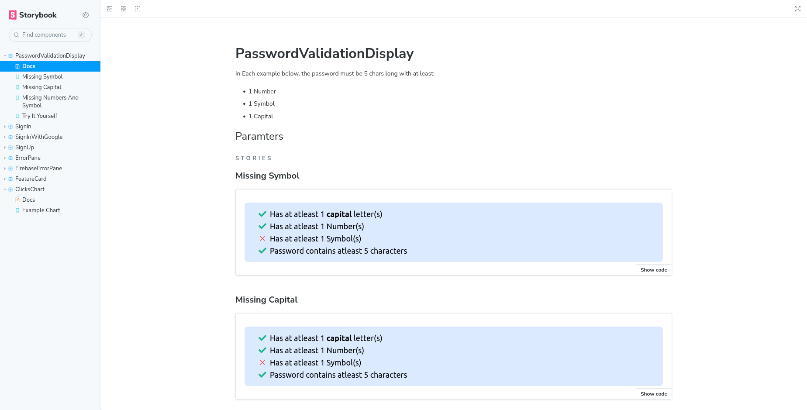
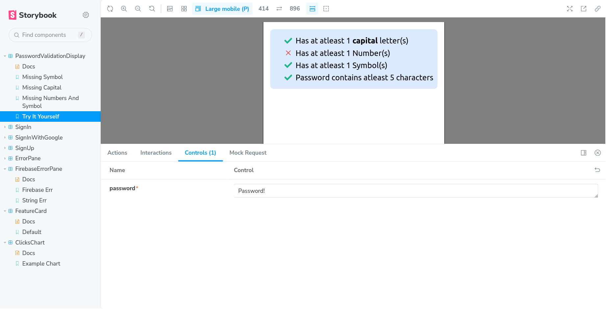
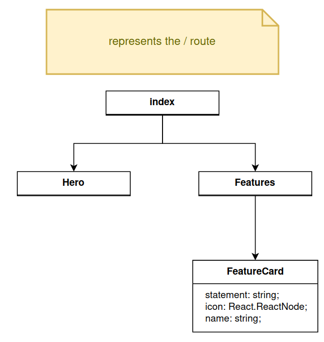
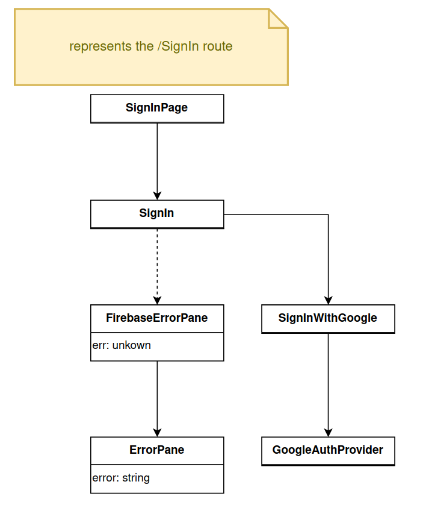
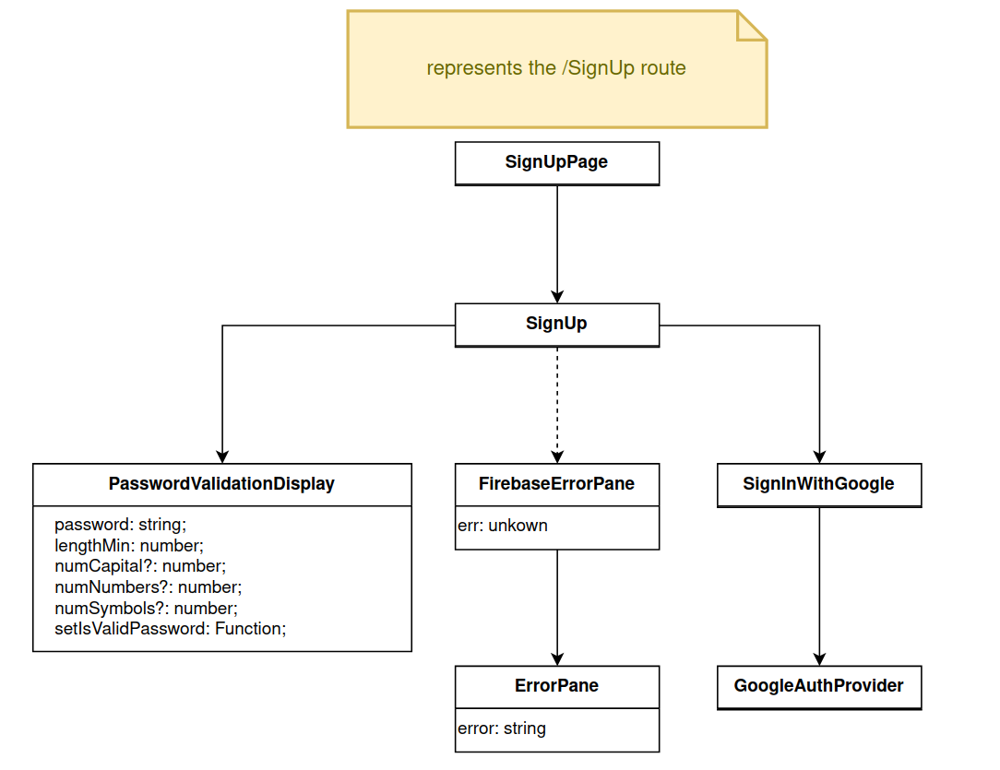
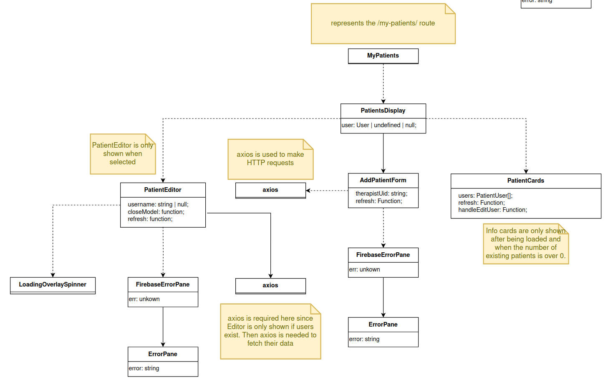
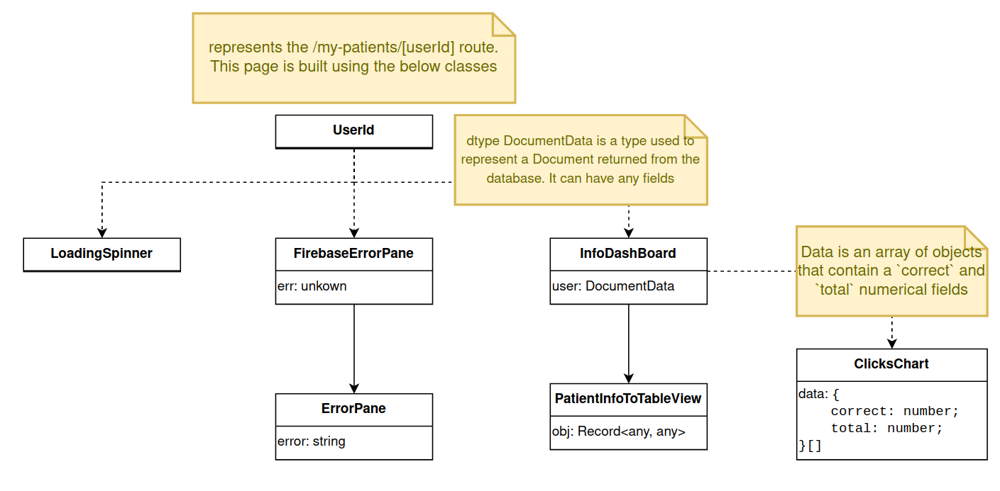

# Website Documentation

The website is powered by NextJS which is a wrapper over ReactJS to provide alternate hydration methods rather than just client-side rendering. NextJS also provides a ready-to-use API layer to setup serverless functions for your website to call.

## Install Dependencies

To run this website you must have node and NPM installed. You can get Node from their [website](https://nodejs.org/en/download) and it should come with NPM.

```
npm i
```
> Note: To run this command you must be `cd`-ed into the webiste folder. In other words, the `package.json` files must appear at the root level of where you are at. You need to be in the same folder as those files to execute this command correctly. 


## Run the development server

You can run the development server with:

```
npm run dev
```

However, if you are not on a Temple Network, you can visit: [parth.fr](https://www.parth.fr/)

## Run the Docs Server

To see the docs for the React Components Used. Run the docs server on localhost via:

```
npm run storybook
```

> Note: For the above command to work you need to have ran `npm i` first. 

The docs are their own standalone website designed via React-Storybook. They show what a standalone component will look like:



> Not all components were inserted into the docs as some components require auth and mock API calls which I did not have time to learn nearing the end of the project.

The docs are also interactive. This means that you can change the state of the standalone component to see its effects. The example below shows input being fed into the `password-validator` component. 




## UML Diagram

Here is a UML Class Diagram based on the Website's Frontend. Many imports are left out because they are usually assumed with react usage or they would just clutter up the diagram. Each diagram represents a route of the website. Each field below is also public. 

> A route is a URL path/pattern.

## `/`: Home Page


## `/sign-in`: Sign In page



## `/sign-up`: Sign Up page



## `/my-patients`: All Patients Dashboard


## `/my-patients/[userId]`: User Information Page




> If the above SVG image does not load you can obtain the PNG image from [here](./public/FE-UML.png)
